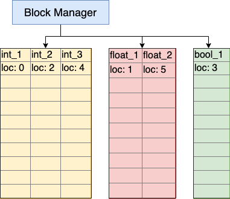
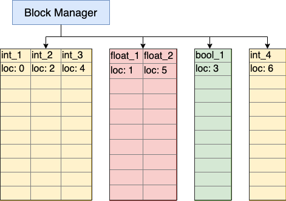
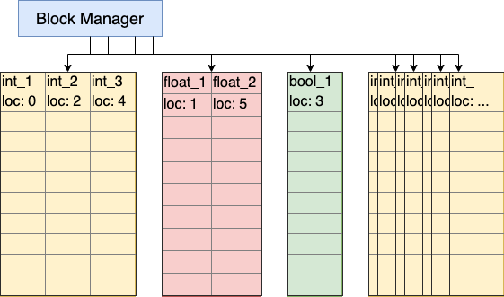
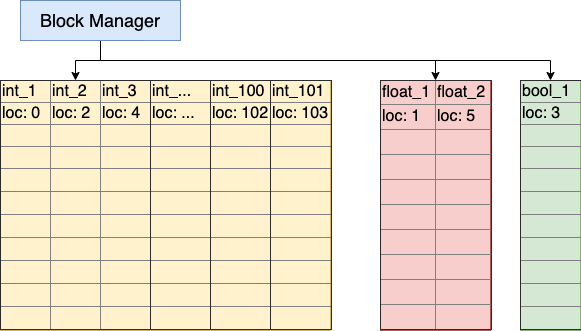

class: title-slide

# Small Dive into Pandas' BlockManager

.larger[Thomas J. Fan]<br>
<span class="icon-social"></span>
@thomasjpfan

---

# Before we start :)

1. If you are from NYC, **Push 1**.
2. Otherwise, **Push 2**.

---

# Pandas users?

1. Yes
2. No

---

# Lets create a DataFrame

```py
df = pd.DataFrame({
    'int_1': np.arange(1000000, dtype=int),
    'float_1': np.arange(1000000, dtype=float),
    'int_2': np.arange(10, 1000010, dtype=int),
    'bool_1': np.ones(1000000, dtype=bool),
    'int_3': np.arange(20, 1000020, dtype=int),
    'float_2': np.arange(10, 1000010, dtype=float),
})

df.head(2)
```

|    |   int_1 |   float_1 |   int_2 | bool_1   |   int_3 |   float_2 |
|---:|--------:|----------:|--------:|:---------|--------:|----------:|
|  0 |       0 |         0 |      10 | True     |      20 |        10 |
|  1 |       1 |         1 |      11 | True     |      21 |        11 |

---

# How is this stored?


|    |   int_1 |   float_1 |   int_2 | bool_1   |   int_3 |   float_2 |
|---:|--------:|----------:|--------:|:---------|--------:|----------:|
|  0 |       0 |         0 |      10 | True     |      20 |        10 |
|  1 |       1 |         1 |      11 | True     |      21 |        11 |

---

# How is this stored?



---

# Pandas API For BlockManager

```py
>>>  df._data

BlockManager
Items: Index(['int_1', 'float_1', 'int_2', 'bool_1', 'int_3', 'float_2'], dtype='object')
Axis 1: RangeIndex(start=0, stop=1000000, step=1)
FloatBlock: slice(1, 9, 4), 2 x 1000000, dtype: float64
IntBlock: slice(0, 6, 2), 3 x 1000000, dtype: int64
BoolBlock: slice(3, 4, 1), 1 x 1000000, dtype: bool
```

```py
>>> df._data.nblocks
3
```
---

# Query the dataframe

A view!

```py
>>> df['int_1'].values
array([     0,      1,      2, ..., 999997, 999998, 999999])
```

Underlying numpy array

```py
>>> df['int_1'].values.base
array([[      0,       1,       2, ...,  999997,  999998,  999999],
       [     10,      11,      12, ..., 1000007, 1000008, 1000009],
       [     20,      21,      22, ..., 1000017, 1000018, 1000019]])
```

---

# Add a new column

Recall

```py
>>> df._data.nblocks
# 3
```

Add new column

```py
df['int_4'] = df['int_1'].values
```

How many blocks now?

```py
>>> df._data.nblocks
```

--

```
4
```

---

# What happened?



---

# What does block look like in code?

```
>>> df._data

BlockManager
Items: Index(['int_1', 'float_1', 'int_2', 'bool_1', 'int_3', 'float_2', 'int_4'], dtype='object')
Axis 1: RangeIndex(start=0, stop=10, step=1)
FloatBlock: slice(1, 9, 4), 2 x 10, dtype: float64
IntBlock: slice(0, 6, 2), 3 x 10, dtype: int64
BoolBlock: slice(3, 4, 1), 1 x 10, dtype: bool
IntBlock: slice(6, 7, 1), 1 x 10, dtype: int64
```

---

# Add another column for fun

```py
%time df['int_5'] = df['int_1'].values
```

How long does it take?

1. ~ 1.3 milliseconds
2. ~ 6.1 milliseconds

--

```
Wall time: 6.18 ms
```

--

```py
>>> df._data.nblocks
# 5
```

---

# Add 94 more columns

```py
%%time
for i in range(94):
    df[f'int_{i + 6}'] = df['int_1'].values
# Wall time: 560 ms
```

```py
>>> df._data.nblocks
# 100
```

---

# What does this look like?



---

# Add one more int column

```py
%time df['int_100'] = df['int_1'].values
```

How long does it take?

1. ~ 1.3 seconds
2. ~ 6.1 milliseconds

--

```
Wall time: 1.3 s
```

---


# What happened? (Consolidation!)



---

# What happened?

```py
>>> df._data.nblocks
# 3

>>> df._data

BlockManager
Items: Index(['int_1', 'float_1', ...], dtype='object', length=104)
Axis 1: RangeIndex(start=0, stop=1000000, step=1)
BoolBlock: slice(3, 4, 1), 1 x 1000000, dtype: bool
FloatBlock: slice(1, 9, 4), 2 x 1000000, dtype: float64
IntBlock: [0, 2, ...], 101 x 1000000, dtype: int64
```

---

# Add another column

```py
>>> df._data.nblocks
# 3
```

```py
%time df.loc[:, "int_102"] = 1
# Wall time: 2.03 ms
```

How many blocks now?

```py
>>> df._data.nblocks
```

--

```
4
```

---

# Using loc?


How about?

```py
%time df.loc[0:10, "int_102"] = 2
```

How long does it take?

1. ~ 1.3 seconds
2. ~ 2 milliseconds

--

```
Wall time: 1.3 s
```

--

```py
>>> df._data.nblocks
# 3
```

---

# Conclusion

- DataFrame operations depends on context
- [Block Manager Rewrite](https://pandas.pydata.org/docs/development/roadmap.html#block-manager-rewrite)
- Implications for scikit-learn - [pandas in pandas out prototype](https://github.com/scikit-learn/scikit-learn/pull/16772)
- [https://thomasjpfan.github.io/lightning-talks](https://thomasjpfan.github.io/lightning-talks)


---

class: end-slide

# fin.

.larger[Thomas J. Fan]<br>
<span class="icon-social-white"></span>
@thomasjpfan

